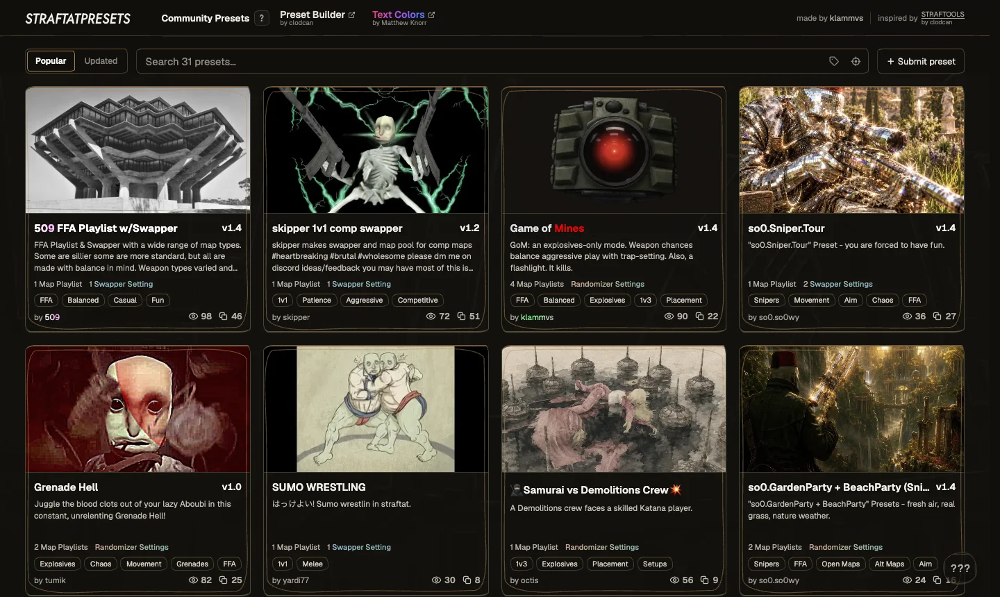
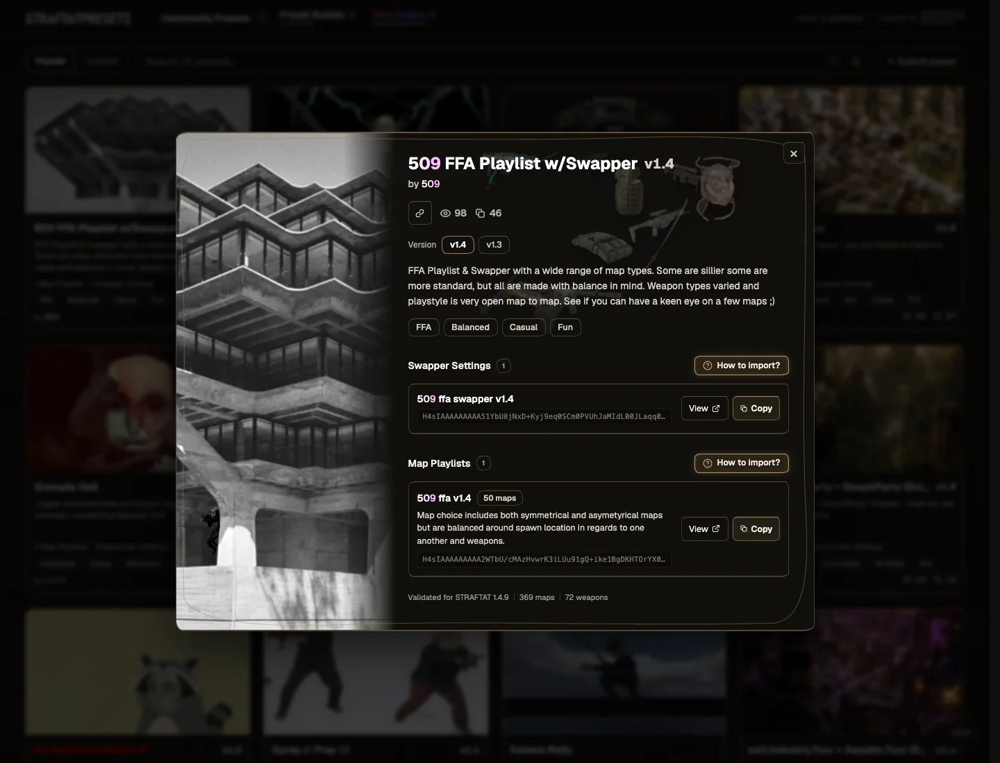

# STRAFTATpresets

Collection of community made Map Playlists, Randomizer and Swapper settings for [STRAFTAT](https://store.steampowered.com/app/2386720/STRAFTAT/) - The Best Game You've Never Heard Of.

Serverless, low-touch, managed storage, Telegram-based moderation.

Made with <3 for the community.

[Browse presets](https://straftatpresets.com/) | [How to import](https://straftatpresets.com/how-to-import)

<div align="center">
	
</div>

## About the code

Built and maintained with AI coding agents. Review the code before self-hosting.

## Local setup

```bash
git clone https://github.com/vsklamm/StraftatPresets.git
cd StraftatPresets
nvm install
nvm use
npm install -g npm@12.0.2
npm ci
npm run dev
```

Open [localhost:3000](http://localhost:3000). D1 and R2 run locally, with persistent state in `.wrangler/`.

For Discord login, copy `.env.example` to `.env.local`, set `DISCORD_CLIENT_ID` and `DISCORD_CLIENT_SECRET`, and register this redirect:

```text
http://localhost:3000/api/auth/callback/discord
```

Local setup creates `NEXTAUTH_SECRET` if missing. Keep environment files untracked.

## Commands

| Command | Purpose |
| --- | --- |
| `npm run check` | Validate catalogs, lint, types, tests and Worker build |
| `npm run preview` | Local Worker preview |
| `npm run db:schema` | Generate a migration after editing `db/schema.ts` |
| `npm run db:migrate` | Apply local migrations |
| `npm run db:backup` | Export D1 to ignored backups |

## Self-hosting on Cloudflare

Create your own resources and update their bindings in `wrangler.jsonc`, including the D1 database ID. Do not use this project's production resources.

```bash
npx wrangler d1 create straftat-presets
npx wrangler r2 bucket create straftat-presets-thumbnails
npx wrangler r2 bucket create straftat-presets-thumbnails-preview
```

Copy `.env.production.example` to `.env.production` and fill it locally. Register `https://your-domain.example/api/auth/callback/discord` with Discord.

Initialize your remote database, replacing the confirmation placeholders with the values in `game-data/catalog.json` and `game-data/tags.json`:

```bash
npx wrangler d1 migrations apply DB --remote
npm run game:sync -- remote --confirm <supported-release>
npm run tags:sync -- remote --confirm <tag-count>
npm run check
npm run deploy
```

Deployment builds the Worker, applies migrations and recalculates published-preset ranking before uploading. Do not bypass it with `wrangler deploy`. Remote commands modify production data unless explicitly read-only.

Enable Cloudflare [Always Use HTTPS](https://developers.cloudflare.com/ssl/edge-certificates/additional-options/always-use-https/) for your domain. Check redirects, HSTS and CSP after deployment. The CSP allows inline scripts and styles, so it is not a strict inline-XSS defense.

Drafts save locally first. Submitted and published revisions are immutable. Thumbnails are converted to WebP and reviewed before publication. Preset text is screened before Telegram moderation.

## Acknowledgements

- [STRAFTAT-Public](https://github.com/Lemaitre-Logiciels/STRAFTAT-Public) by Lemaitre Logiciels: game logic and UI reference.
- [STRAFTOOLS](https://straftools.vercel.app/) by clodcan: preset structure, map playlist encoding and tool UX.
- [StraftatFX](https://matthewknorr.github.io/StraftatFX/) by Matthew Knorr: rich text colors and gradients.

## License

Original project code is [MIT-licensed](LICENSE). Game assets and other third-party material have separate terms. See [third-party notices](THIRD_PARTY_NOTICES.md).
